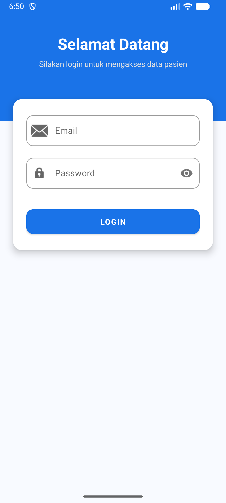

# Tugas 5 Pemrograman Mobile - Retrofit & RecyclerView

### Identitas Mahasiswa
* **Nama:** Naufal Ihsanul Islam
* **NIM:** F1D02310084
* **Kelas:** C

---

## Hasil Aplikasi (Screenshots)

Berikut adalah tampilan aplikasi saat dijalankan:

| Halaman Login | Halaman Daftar Pasien (RecyclerView) |
|:---:|:---:|
|  |  |

---

## Fitur & Alur Kerja Aplikasi

Aplikasi ini memiliki alur kerja dan fitur utama sebagai berikut:

* **Halaman Login (Autentikasi API)**:
  * Dilengkapi validasi input (email dan password tidak boleh kosong).
  * Indikator progress bar (loading state) saat proses login berlangsung ke REST API.
  * Menampilkan notifikasi Toast jika login berhasil atau gagal.
* **Manajemen Token & Sesi**:
  * Menyimpan token hasil login (`data.token`) dan nama user (`data.user.name`), kemudian meneruskannya ke halaman data pasien menggunakan Intent.
* **Request & Tampilan Data Pasien**:
  * Melakukan HTTP GET request ke endpoint `/api/pasien` dengan menyertakan token pada header `Authorization` (menggunakan format `Bearer {token}`).
  * Menampilkan data pasien secara dinamis (Nama, Tanggal Lahir, Jenis Kelamin, Alamat, dan Nomor Telepon) secara rapi menggunakan `RecyclerView` dengan layout kustom `CardView`.

---

## Endpoint API

* **Login (POST)**: `https://api.pahrul.my.id/api/login`
  * Body: `email` & `password`
* **Daftar Pasien (GET)**: `https://api.pahrul.my.id/api/pasien`
  * Header: `Authorization: Bearer <token>`

---

## Struktur File Penting

* **`Models.kt`**: Berisi data class untuk mapping JSON response API.
* **`RetrofitClient.kt`**: Inisialisasi Retrofit client dan logging interceptor.
* **`ApiService.kt`**: Interface endpoint HTTP POST & GET.
* **`LoginActivity.kt`**: Logika login, validasi input, dan parsing token.
* **`PasienActivity.kt`**: Mengambil data pasien dari API dan memasangnya ke adapter.
* **`PasienAdapter.kt`**: Mengikat list objek `Pasien` ke komponen view di RecyclerView.

---

## Tech Stack

* **Language**: Kotlin
* **Libraries**: Retrofit 2, OkHttp 3, Gson Converter
* **Architecture/UI**: View Binding, RecyclerView, CardView, Coroutines (`lifecycleScope`)